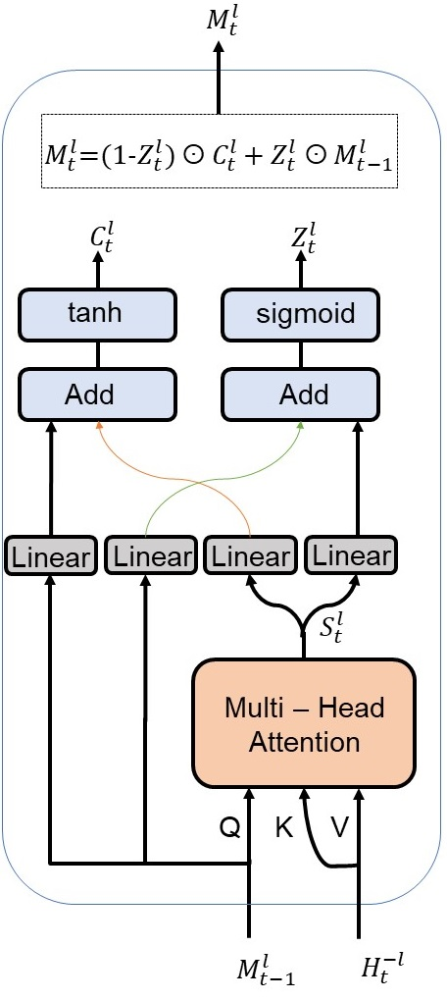

Exploring attention mechanisms and hierarchical summarization in video captioning
=====
This is the Ph.D. Thesis of Leonardo Vilela Cardoso for evaluating the impact of different attention mechanisms and hierarchical feature selection.

## Abstract

The addition of attention mechanisms can improve the quality of descriptions generated in the video captioning task, promoting the creation of more coherent paragraphs. However, in long videos, information relevant to the context may be discarded, resulting in redundant descriptions that compromise the quality of the sentences produced. To mitigate this problem, it is possible to employ complementary techniques that smooth the reduction imposed by the video sampling process. While sequential approaches do not consider the temporal distribution of information, summarization-based methods evaluate the semantic importance of the content, prioritizing the selection of a larger number of significant events. In this context, the use of summarization as a pre-processing step is still little explored in the video captioning task. However, different summarization strategies tend to generate different results. To investigate this aspect, this work applies different summarization techniques in the selection of frames, dynamically or statically, in order to assist the transformer enhanced with adaptive attention mechanisms. Three new approaches are proposed: Adaptive Transformer, \ac{HSAT}, and SkimCap. The Adaptive Transformer model adopts a sequential frame selection policy; HSAT employs a graph hierarchy to select a fixed number of key frames representative of the video; and SkimCap presents variations in its selection policy, being trained with features obtained by dynamic hierarchical clustering and tested with frames chosen by the same strategy or by a supervised model trained on the SumMe dataset. This configuration aims to prove both the quality of the hierarchical segment selection and the generalization capacity of the model. The number of frames used varies according to the strategy adopted, being 10 frames in HSAT and 100 in the other approaches. Among the variants, SkimCap stands out as the most promising model. Unlike traditional approaches, which depend on uniform sampling or predefined temporal segments, SkimCap performs unsupervised hierarchical clustering to identify and extract semantically relevant scenes. These condensed representations offer a compact yet information-rich input, enabling the generation of more accurate and contextualized captions. The memory module enhances the modeling of long-range dependencies, while adaptive attention improves the temporal alignment between visual cues and generated tokens. The model was evaluated in the ActivityNet dataset, achieving scores for CIDEr-D of 25.44, BLEU@4 of 10.77, and Repetition@4 of 5.84, indicating consistent improvements in caption quality and relevance. An ablation study confirms the effectiveness of hierarchical summarization as a feature selection mechanism, highlighting its contribution to overall performance. SkimCap thus establishes a new direction for incorporating structured visual summarization into end-to-end captioning systems.

## Proposed Models
The problem of dense video captioning is related to the amount of similar information laid out sequentially with little or no variation. The relationship between the distribution of frames has a direct impact on the sentences generated and implies an increase or not in repetition. But, in many cases, part of the generated sentences can be repeated, diminishing the quality of the final result. That is more evident in an event-based description because, if there are different events (video segments) with high correlation, there is a high possibility that the same (or almost the same) sentence fragment appears more than once in the final result. Currently, some methods try to cope with that. However, this task is not trivial since it consists of evaluating the relationship between a text excerpt and all others being produced so that the described event is not repeated in the final result. Thus, some authors have studied the impact of applying methods based on deep learning in improving recognition of that kind of pattern. The use of learning techniques that make it possible to recurrently evaluate and relate the produced sentences has gained prominence because they generate sentences more consistent with the context by assessing the importance and contribution of each word to the final result.


### Enhanced Memory Transformer

To deal with coherence and reduce repetition, one possibility is the use of memory similar to one recurrent network.  Memory is used to control past information and newly learned information. This is the proposal for three new memory updater modules used to access each produced sentence's degree of relevance, present in Figure 1.

<p align="center">
  Figure 1 <br>
  <!---->
  
  
  
</p>

More information avalable on: [EMT](https://github.com/IMScience-PPGINF-PucMinas/EMT).
or on our paper: [EMT Published on ICTAI 2021](https://ieeexplore.ieee.org/document/9643266)

### Adaptive Transformer

Another perspective is the analysis of the attention inside of the transformer. Thus, we propose to improve the self-attention module that exists within the main backbone of the transformer (just after the multi-head attention modules). So, we adopted additional attention blocks to emphasize the data generated by self-attention and cross-attention. The outline of our proposal, named Adaptive Transformer, is shown in Figure 2, which focuses on reducing repetition. The memory module is still an important part of the shared transformer module, and this is responsible to capture the long-term dependency of the sentences.

<p align="center">
  Figure 2 <br>
  
</p>

More information avalable on: [Adaptive transformer](https://github.com/IMScience-PPGINF-PucMinas/Adaptive-Transformer)
or on our paper: [Adaptive transformer Published on BigMM 2022](https://ieeexplore.ieee.org/document/9999093)

### Hierarchical Time-Aware Keyframe Selection

Unlike the traditional approach that uses a sequential selection policy for frame selection, our proposed method chooses frames based on their similarity. It adopts a hierarchical graph-based summarization method to obtain the most valuable frames (as keyframes), present in Figure 3.

<p align="center">
  Figure 3 <br>
  
</p>

A frame similarity graph is constructed and used by the video summarization approach. In this graph, each vertice represents a video frame. An edge between two vertices only exists if the difference between their time indexes is lower than a threshold  $\delta_t$. The edge weight represents the similarity value between the two frames associated with edge extremes. This process is shown in Figure 4.

<p align="center">
  Figure 4 <br>
  
</p>

The use of the threshold $\delta_t$ can be used to restrict the relationship between video frames far away and implies that our hierarchical graph-based summarization approach is time-aware (which also differs from many video summarization works in the literature.

More information avalable on: [HSAT Published on IJSC 2023](https://www.worldscientific.com/doi/abs/10.1142/S1793351X23640031)

### Hierarchical Time-Aware Keyframe Selection

Video summarization involves generating a concise video representation that captures all its meaningful information. However, conventional summarization techniques often fall short of capturing all the significant events in a video due to their inability to incorporate the hierarchical structure of the video content. In this regard, hierarchical strategies for video summarization have emerged as a promising solution, in which video content is modeled as a graph to identify keyframes that represent the most relevant information. This approach enables the extraction of the frames that convey the central message of the video, resulting in a more effective and precise summary.

More information avalable on: [HieTaSumm on Bracis 2023](https://link.springer.com/chapter/10.1007/978-3-031-45368-7_18)

### Unsupervised Video Skimming with Adaptive Hierarchical Shot Detection

Video skimming involves generating a concise representation that captures all its significant information. However, conventional skimming techniques often fail to capture different shots in a video due to their inability to detect scene modifications and incorporate the hierarchical structure of video content.

More information avalable on: [HieTaSkim on Sibgrapi 2024](https://ieeexplore.ieee.org/abstract/document/10716326)

### Streamlined extended Long Short-Term Memory for video skimming

Video skimming aims to generate concise yet informative summaries that highlight the most salient aspects of a video. However, conventional methods often struggle with diverse and redundant content due to their limited ability to detect scene transitions and insufficient temporal modeling. To address these challenges, we propose Streamlined Extended Long Short-Term Memory (StreamExLSTM), a supervised architecture derived from a streamlined variant of the extended Long Short-Term Memory (xLSTM) model.

More information avalable on: [Streamlined on PRL 2025](https://link.springer.com/chapter/10.1007/978-3-031-45368-7_18)

### Memory-Augmented Long Short-Term Memory for Dynamic Video Summarization

Capturing relevant content from videos while preserving temporal coherence remains a central challenge in video skimming. The prevalence of redundant information often hinders the extraction of meaningful content, especially when the goal is to retain the central narrative of the video. While scene change detection can aid in segmenting video content, conventional methods often struggle with highly diverse and repetitive scenes due to their limited ability to model temporal dependencies and detect transitions effectively.

More information avalable on: [MALSumm on Sibgrapi 2025](https://ieeexplore.ieee.org/abstract/document/11223357?casa_token=S7wlDds_SP0AAAAA:hqlAwD3Ep9H8v8-7WCAni7gnqMocgydS1ZtdTgdL8lNSnBi_KmePVAAkkdlhLvfZCHwcaoDz)


### SkimCap: A Transformer-Based Video Captioning Method with Adaptive Attention and Hierarchical Skimming Features

We present SkimCap, a transformer-based video captioning framework that integrates a memory-augmented architecture with adaptive attention and a novel feature selection strategy grounded in hierarchical video skimming. Unlike traditional approaches that rely on uniformly sampled frames or pre-defined temporal segments, SkimCap performs unsupervised hierarchical clustering to identify and extract semantically salient video shots. These condensed representations provide a compact yet information-rich input to the captioning model, enabling more accurate and contextually grounded sentence generation.

More information avalable on: [SkimCap on Sibgrapi 2025](https://ieeexplore.ieee.org/abstract/document/11223503?casa_token=UdVxNGNjopEAAAAA:gMJVfxEZF-ssqxozN4lksWPNVgKRR4MHvjLoKJDslf6aJFUiGBeSkML35qnbCTjw5WzAzgJF)

## Results

To further promote the perception of the results obtained and their improvements, the inconsistencies of every approach had been highlighted to facilitate the visualization: (i) red/bold for cases of use of different pronouns from the ones in the GT result (or when they are misused); and (ii) blue/bold for the occurrences of a repeated sentence in the paragraph.

### Dataset
We apply the proposed methods to the ActivityNet Captions (ANC) dataset. This dataset contains 10,009 videos for training and 4,917 videos for validation. Videos used during the training step have a single reference paragraph, while validation videos have two reference paragraphs. Here, we follow the subdivision of this dataset to optimize the video use and avoid overfitting. These subdivisions kept the training videos and divided the validation videos into two subsets, namely: ae-val with 2,460 videos for validation and ae-test with 2,457 videos for testing.

### Evaluation Metrics
The evaluation of sentences is a separate challenge, as there are several ways to write sentences, but with the same meaning, whether using synonyms or emphasizing information. This process is intuitive for humans. However, there is not a specific approach for evaluating the video captioning task. So, what is usually done is the adaptation of machine translation metrics extended for this task, such as Bleu-4, CIDEr-D, and Repetition-4.

### Video Captioning with Attention Applied on Memory Transformer
The paragraph generated by using different attention methods on memory has a different focus than the description in the GT result, as shown in Figure 5. However, it is still possible to observe that the result produced preserves coherence and context with a low repeatability rate.

<p align="center">
  Figure 5 <br>
  
</p>

### Video Captioning with Attention Used to Reinforce a first Self or Cross Attention

The qualitative results for the Adaptive Transformer are closer to the GT, it is possible to notice that the descriptions have coherence and fluidity. In addition, repeatability is reduced. The Figure 6 presents the result for the Adaptive transformer, and it's possible to notice that the result does not have pronoun errors or repetition and captures the continuity of the scene. But, the result does not have all descriptions compared to GT.
 
<p align="center">
  Figure 6 <br>
  
</p>

### Video Captioning with Hierarchical Time-Aware Keyframe Selection

The results found for HSAT demonstrate that it presents an improvement related to the detection of video events. When compared to the sequential selection of frames, the amount of information that the method does not observe/process is large.

In some cases, when the sequential selection of frames is used, only the first one hundred frames with a rate of 2 FPS are used to represent the video. Thus, for A video with a length greater than 50 seconds, all information after the first 50 seconds is ignored. On the ANC dataset, the videos do not have the same length, the number of events varies from 2 to 6, and, in some cases, one video has more than two hundred seconds. Because of this, summarization appears as a better way to evaluate the content distributed in the entire video. Thus, the neglected information due to time limitations adopted in a sequential selection of frames does not exist with the hierarchical summarization approach. 

Despite that HSAT selects a relatively less number of frames (only 10), it is sufficient to cover all videos of the dataset (since the number of events in ANC dataset varies from more than 2).


Figure 7 and Figure 8 show the diversity of video content present in the dataset. The first shows the summarization result in a short video that has 25 seconds. Since it is a short video, the summarization process returns similar frames, however, with some minor variations in perspective. In video summarization, the amount of frames remains the same for all videos and the fluidity of the video is maintained. In addition, it is possible to correctly follow the actions over time without neglecting the video context.

<p align="center">
  Figure 7 <br>
  
</p>

Figure 8 shows the frames selected as Keyframes for the HSAT method. While Figure 9 illustrates the selected frames  when a sequential selection (with time constraints) is made.
One can observe that in Figure 9 some content is not present at all. In contrast, HSAT manage to obtain a greater variety of video content making it easier to describe different moments of the video. In the sequential selection of frames, since that video has 80 seconds, it disregards any information that occurs in the final 30 seconds. In turn, HSAT uses hierarchical summarization to cover a greater variety of instants. In this way, HSAT only disregards very similar frames that are direct neighbors in time to include more distinct and meaningful frames for the video description. Due to the summarization process, the number of frames used can be reduced, generating results as significant as for techniques with large amounts of frames.

<p align="center">
  Figure 8 <br>
  
</p>

<p align="center">
  Figure 9 <br>
  
</p>

Figure 10 presents a qualitative comparison between the result obtained by the HSAT with the Adaptive Transformer. As one can see, the result is very discriminative and does not have many repetitions of terms. The results presented show very approximate descriptions. But, with some points described from another perspective. Thus, as HSAT uses features taken from different regions of the video and analyzes the importance of each frame in time, the modifications related to the description are due to the presence of points that may not be visualized in the same set of frames used to illustrate the video content. In this way, hierarchical summarization presents itself as a great candidate to improve the descriptions produced for the video captioning task.

<p align="center">
  Figure 10 <br>
  
</p>

## Another Works and Implementation Details
[EMT](https://github.com/IMScience-PPGINF-PucMinas/EMT).

[Adaptive transformer](https://github.com/IMScience-PPGINF-PucMinas/Adaptive-Transformer)

[HSAT](https://github.com/IMScience-PPGINF-PucMinas/HSAT)

[HieTaSumm](https://github.com/IMScience-PPGINF-PucMinas/HieTaSumm)

[HieTaSkim](https://github.com/IMScience-PPGINF-PucMinas/HieTaSumm-lib)

[Streamlined](https://github.com/IMScience-PPGINF-PucMinas/StreamExLSTM)

[MALSumm](https://github.com/IMScience-PPGINF-PucMinas/MALSumm)

[SkimCap](https://github.com/IMScience-PPGINF-PucMinas/SkimCap)

[HieTaSumm Library on Pip](https://test.pypi.org/project/HieTaSumm/)

Last version on test server will be installed under:

pip install -i https://test.pypi.org/simple/ HieTaSumm

Usage example: 

HieTaSumm(

        video_path='/content/videos',
        
        percent=15,
        
        rate=2,
        
        time=2,
        
        alpha=100,
        
        selected_model='vgg16',
        
        summary_path='/content/skim-5-vgg',
        
        gen_summary_method={"method": "group_central_frames"},
        
        hierarchy="watershed_hierarchy_by_area"
    
    )


## Citations
If you find this work useful for your research, please cite our papers:


```
@inproceedings{cardoso2025skimcap,
  title={SkimCap: A Transformer-Based Video Captioning Method with Adaptive Attention and Hierarchical Skimming Features},
  author={Cardoso, Leonardo V and Azevedo, Bernardo PBV da C and Guimar{\~a}es, Silvio Jamil F and Patroc{\'\i}nio, Zenilton KG},
  booktitle={2025 38th SIBGRAPI Conference on Graphics, Patterns and Images (SIBGRAPI)},
  pages={1--6},
  year={2025},
  organization={IEEE}
}

@inproceedings{cardoso2025memory,
  title={Memory-Augmented Long Short-Term Memory for Dynamic Video Summarization},
  author={Cardoso, Leonardo Vilela and Soraggi, Barbara HP and Guimar{\~a}es, Silvio Jamil F and Patroc{\'\i}nio, Zenilton KG},
  booktitle={2025 38th SIBGRAPI Conference on Graphics, Patterns and Images (SIBGRAPI)},
  pages={1--6},
  year={2025},
  organization={IEEE}
}

@article{cardoso2025streamlined,
  title={Streamlined extended long short-term memory for video skimming},
  author={Cardoso, Leonardo Vilela and Soraggi, Barbara Hellen P and Guimar{\~a}es, Silvio Jamil F and Patroc{\'\i}nio Jr, Zenilton KG},
  journal={Pattern Recognition Letters},
  year={2025},
  publisher={Elsevier}
}

@inproceedings{cardoso2024unsupervised,
  title={Unsupervised Video Skimming with Adaptive Hierarchical Shot Detection},
  author={Cardoso, Leonardo Vilela and Werneck, July FM and Guimar{\~a}es, Silvio Jamil F and Patroc{\'\i}nio, Zenilton KG},
  booktitle={2024 37th SIBGRAPI Conference on Graphics, Patterns and Images (SIBGRAPI)},
  pages={1--6},
  year={2024},
  organization={IEEE}
}

@inproceedings{cardoso2023bracis,
  title={Hierarchical Time-Aware Approach for Video Summarization},
  author={Cardoso, Leonardo Vilela and Gomes, Gustavo Oliveira Rocha and Guimar{\~a}es, Silvio Jamil Ferzoli and do Patroc{\'\i}nio J{\'u}nior, Zenilton Kleber Gon{\c{c}}alves},
  booktitle={Brazilian Conference on Intelligent Systems},
  pages={274--288},
  year={2023},
  organization={Springer}
}

@article{cardoso2023ijsc,
  title={Hierarchical time-aware summarization with an adaptive transformer for video captioning},
  author={Cardoso, Leonardo Vilela and Guimaraes, Silvio Jamil Ferzoli and do Patrocinio Junior, Zenilton Kleber Goncalves},
  journal={International Journal of Semantic Computing},
  year={2023},
  publisher={World Scientific}
}

@inproceedings{cardoso2022exploring,
  title={Exploring adaptive attention in memory transformer applied to coherent video paragraph captioning},
  author={Cardoso, Leonardo Vilela and Guimaraes, Silvio Jamil F and Patrocinio, Zenilton KG},
  booktitle={2022 IEEE Eighth International Conference on Multimedia Big Data (BigMM)},
  pages={37--44},
  year={2022},
  organization={IEEE}
}

@inproceedings{cardoso2021enhanced,
  title={Enhanced-Memory Transformer for Coherent Paragraph Video Captioning},
  author={Cardoso, Leonardo Vilela and Guimaraes, Silvio Jamil F and Patroc{\'\i}nio, Zenilton KG},
  booktitle={2021 IEEE 33rd International Conference on Tools with Artificial Intelligence (ICTAI)},
  pages={836--840},
  year={2021},
  organization={IEEE}
}
```

## Contact
"Leonardo Vilela Cardoso" with this e-mail: "leonardocardoso@pucminas.br"

"Zenilton Kleber Gonçalves do Patrocínio Junior" with this e-mail: "zenilton@pucminas.br"

